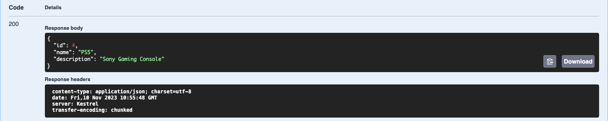

# Тестування працездатності системи (Swagger)

У цьому розділі продемонстроване тестування системи і взаємодія з такими моделями як Project та Team\

## Projects

### Початкове наповнення бази даних

    

### Get (All)

    

### Post
Введення користувача

    

Відповідь сервера

    

### Get/Id
Введення користувача

    

Відповідь сервера

    

### Put
Введення користувача

    

Відповідь сервера

    

### Delete
Введення користувача

    

Відповідь сервера

    

## Teams

### Початкове наповнення бази даних

    

### Get (All)

    

### Post
Введення користувача

    

Відповідь сервера

    

### Get/Id
Введення користувача

    

Відповідь сервера

    

### Put
Введення користувача

    

Відповідь сервера

    

### Delete
Введення користувача

    

Відповідь сервера

    

